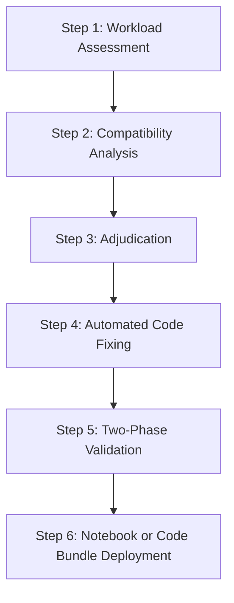

# Workflow - PySpark to Snowpark Connect (SCOS) Migration

**Type:** End-to-End Migration Workflow
**Source:** Snowflake-Labs/coco-skills
**Primary Skill:** [[Skill - Snowpark Connect]]
**Default Path:** Yes (Recommended for Spark Workloads)
**Last Reviewed:** 2026-09-24

---

## Workflow Overview

Snowpark Connect (SCOS) preserves the native PySpark API surface (`withColumn`, `groupBy`, `spark.createDataFrame`) while redirecting query execution to Snowflake's compute engine. This eliminates the need to rewrite complex PySpark code into Snowpark DataFrame API syntax.

---

## Phase Breakdown



### Step 1: Workload Assessment
- **Skill:** [[Skill - Assess PySpark Workload]]
- **Action:** Scan Spark scripts and notebooks. Produce compatibility score and estimate conversion effort.
- **Prompt:**
  ```text
  Assess my PySpark workload in ./spark_jobs for Snowflake Snowpark Connect compatibility.
  ```

### Step 2: Compatibility Analysis
- **Agent:** [[Agent - SCOS PySpark Analyzer]]
- **Action:** Identifies unsupported constructs (e.g. RDDs, custom JVM hooks) and generates `analysis.json`.

### Step 3: Issue Adjudication
- **Agent:** [[Agent - SCOS PySpark Adjudicator]]
- **Action:** Triages deferred issues to determine true incompatibilities vs false positives.

### Step 4: Automated Code Fixing
- **Agent:** [[Agent - SCOS PySpark Fixer]]
- **Action:** Applies automated source modifications, redirecting Spark sessions to Snowpark Connect.

### Step 5: Two-Phase Verification & Validation
- **Skill:** [[Skill - Validate PySpark to Snowpark Connect]]
- **Agents:** [[Agent - SCOS PySpark Harvester]], [[Agent - SCOS PySpark Patch Author]], [[Agent - SCOS PySpark SCOS Runner]]
- **Action:** Generates synthetic data, executes Phase A (Spark baseline) and Phase B (SCOS execution), and asserts dataset parity.

### Step 6: Production Deployment
- **Skills:** [[Skill - Deploy Notebook]] or [[Skill - Deploy Code Bundle]]
- **Action:** Deploys verified assets as native Snowflake Notebooks or Git-backed Code Bundles.

---

## Related Notes

- [[Skill - Snowpark Connect]]
- [[Skill - Migrate PySpark to Snowpark Connect]]
- [[Skill - Validate PySpark to Snowpark Connect]]
