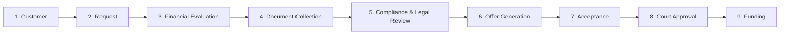
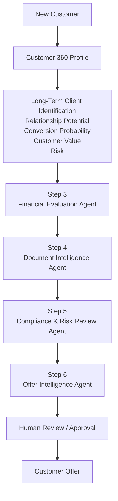

# Decision — Move Forward with JGW USE CASE

**Date:** 2026-07-29
**Status:** Decision Made — POC Scope Defined
**Theme:** AI-Powered Client Qualification & Deal Intelligence Agent

---

## Core Operational Sequence (JGW Workflow)



> **POC Focus:** Steps **3, 4, 5 & 6** — these are the intelligence layers where AgentBricks adds maximum value.

---

## The Use Case: AI-Powered Client Qualification & Deal Intelligence Agent

The system doesn't merely identify a "long-term customer." Instead, when a customer enters the process, the platform builds a **Customer/Deal Intelligence Profile** answering:

> *"Is this a high-value customer/deal worth pursuing, what is their likelihood of successful conversion and future engagement, what risks or missing information exist, and what should JGW do next?"*

This connects the client's **long-term client identification** requirement directly to JGW operations.

---

## Step 3 — Intelligent Financial Evaluation (AgentBricks)

**Data Inputs:** Customer profile + payment schedule + transaction/payment history + previous cases + financial calculations + credit information + current request

**Calculated Signals:**

| Signal | Description |
|--------|-------------|
| **Customer Value Score** | Economic value of this relationship/case |
| **Conversion Probability** | Likelihood the customer accepts an offer |
| **Long-Term Relationship Potential** | One-time vs. repeat engagement customer |
| **Eligibility Score** | Fit against JGW's historical successful-case characteristics |
| **Financial Risk Score** | Items requiring additional investigation |

**Example Agent Output:**

> **Customer 10452**
> - Long-Term Potential: **82/100**
> - Conversion Probability: **76%**
> - Customer Value: **High**
> - Financial Risk: **Low**
> - **Recommended Action:** Prioritize
> - **Reason:** Customer has a strong payment stream, favorable case characteristics, complete historical payment behavior, and resembles previously successful customers.

---

## Step 4 — Intelligent Document Collection (AgentBricks)

**Required Documents:**
- Settlement Agreement
- Identity Document
- Payment Schedule
- Bank Statement
- Court Documentation
- Supporting Financial Documents

**Agent Determines:**
- What documents have been received?
- What is missing?
- Are documents internally consistent?
- Are important values extractable?
- Does anything conflict with the customer's submitted information?

**Example Agent Output:**

> ### Document Readiness
> **83% Complete**
> - ✅ Settlement Agreement received
> - ✅ Identity verified
> - ✅ Payment Schedule extracted
> - ✅ Bank Statement received
> - ⚠️ Court Order missing
> - ⚠️ Settlement Agreement payment amount differs from submitted request
>
> **Recommended next action:** Request court order and verify payment amount before compliance review.

---

## Step 5 — Compliance, Legal & Risk Intelligence (AgentBricks)

**Inputs — Structured:**
- Customer details
- Financial information
- Case history
- Transaction history
- Risk indicators

**Inputs — Unstructured:**
- Settlement agreement
- Contracts
- Court documents
- Identity documents
- Supporting documents

**Inputs — Policies:**
- JGW policies / compliance rules

**Example Agent Output:**

> ### Compliance Assessment
> **Overall Risk: MEDIUM**
>
> | Check | Result |
> |-------|--------|
> | Identity | ✅ Verified |
> | Required Documents | ⚠️ 1 Missing |
> | Financial Consistency | ✅ Passed |
> | Settlement Validation | ✅ Passed |
> | Policy Eligibility | ✅ Passed |
> | Legal Review | ⚠️ Required |
> | Historical Risk | ✅ Low |
>
> **Reasoning:** Customer satisfies the primary financial and eligibility requirements. However, court documentation has not been provided. The case should proceed to legal review but should not move to final offer approval until the missing document is validated.

> **Key Principle:** Agent recommends → human approves. The POC is NOT positioned as AI autonomously making legal decisions.

---

## Step 6 — Intelligent Offer Recommendation (AgentBricks)

All outputs from Steps 3 + 4 + 5 feed into this step.

**Inputs:**
```text
Financial Evaluation
        +
Customer Value
        +
Long-Term Potential
        +
Conversion Probability
        +
Document Readiness
        +
Compliance Assessment
        +
Historical Similar Cases
        +
Company Policies
        ↓
Offer Intelligence Agent
```

**Approach:** Deterministic financial logic calculates the permissible offer range. AgentBricks reasons around that calculation.

**Example Agent Output:**

> ### Recommended Offer
> - Eligible Range: **$82,000 – $91,000**
> - Recommended Offer: **$88,500**
> - Conversion Probability: **81%**
> - Customer Long-Term Potential: **High**
> - Risk: **Low**
>
> **Why?** Similar historical customers within this financial profile showed stronger acceptance around this offer position. The customer has strong eligibility, low compliance risk and high relationship potential.
>
> **Alternative Strategy:** Increasing offer to $90,000 could increase predicted acceptance from 81% → 87%, while remaining within the approved range.

---

## Final POC Definition

### JGW AI Client & Deal Intelligence Platform

**Core Objective:** Identify high-potential long-term customers early and intelligently guide each case through financial evaluation, document readiness, compliance assessment and offer recommendation.

### Architecture

![[Excalidraw/JGW_AI_Architecture.excalidraw.md]]

### End-to-End Lifecycle



### Why This Approach Over a Standalone "Long-Term Client Predictor"

A standalone predictor mostly demonstrates **ML**. This expanded workflow demonstrates **Databricks as a complete intelligence platform**:

| Capability | Databricks Component |
|------------|---------------------|
| Customer & transaction data | **Lakehouse / Delta** |
| Governed access | **Unity Catalog** |
| Document intelligence | **Document Intelligence** |
| Long-term potential, conversion, risk | **ML/AI** |
| Policies & historical cases | **Vector Search** |
| Reasoning & orchestration | **AgentBricks** |
| Models, evaluation & agent observability | **MLflow** |
| Business-facing application | **Databricks Apps** |

> **Bottom line:** Keep the client's "Long-Term Client Identification" as the headline business problem, but implement Steps 3–6 as the actual AgentBricks workflow. This gives us something substantially stronger than a chatbot or a customer-scoring demo.
