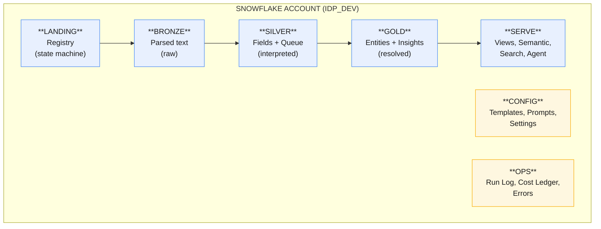
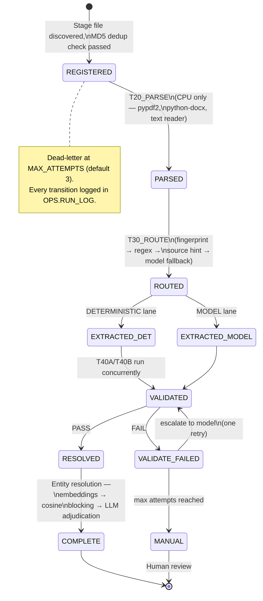
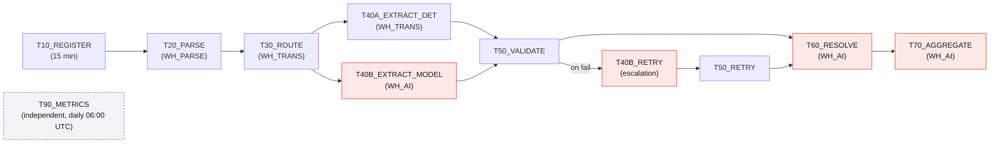
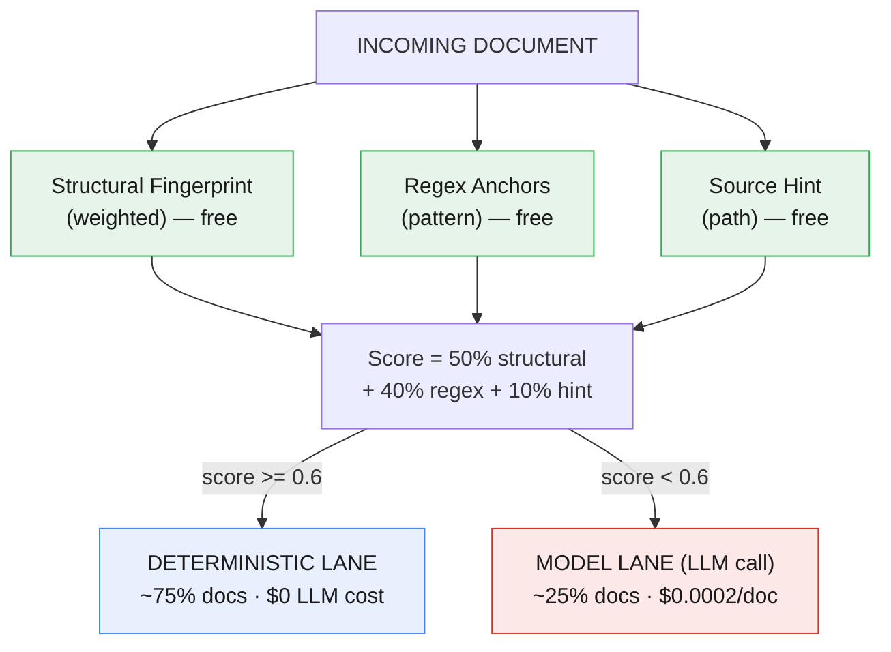
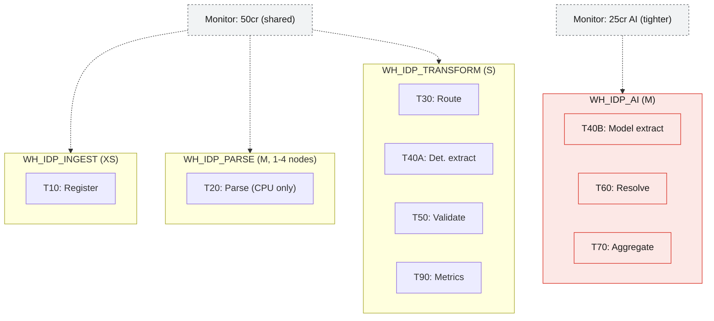
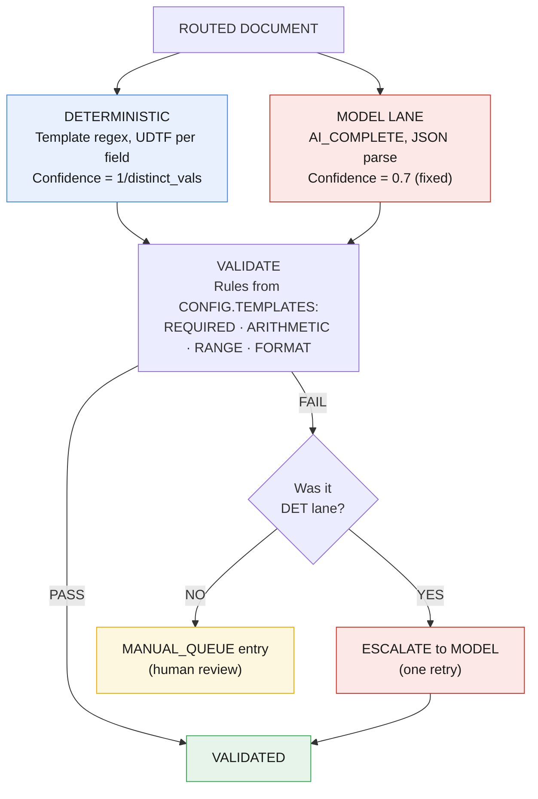
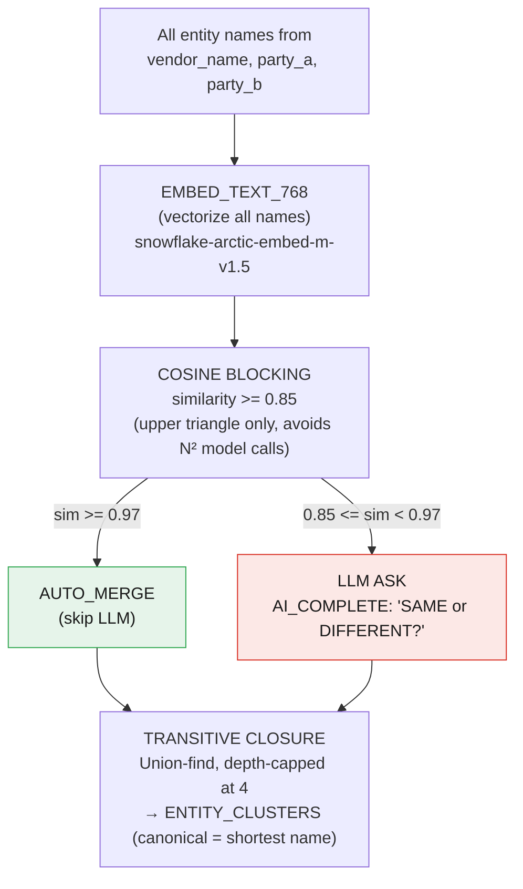
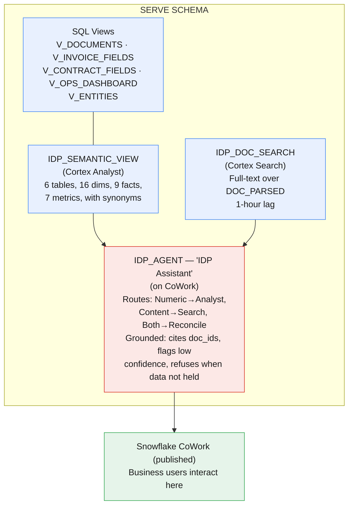
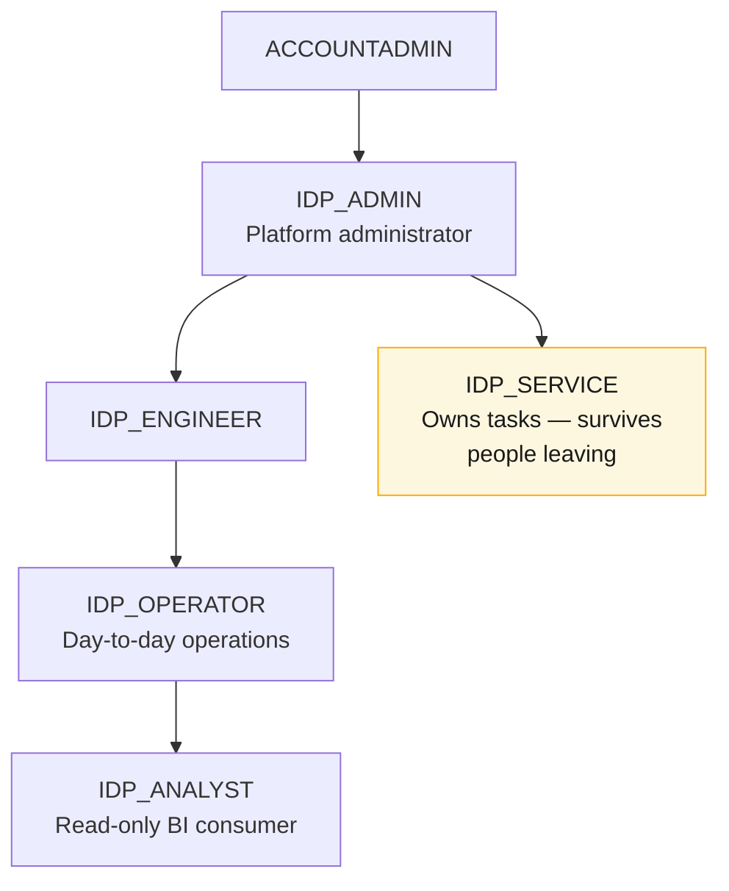

# IDP Platform Architecture

## What It Does

The platform ingests mixed business documents (invoices, purchase orders, contracts, KYC packs), parses them, classifies them, extracts structured fields, validates the extraction, resolves entities across documents, and serves the results to both BI consumers and a conversational AI agent — all running entirely inside Snowflake.

## Quick Start

```bash
# 1. Run preflight
snow sql -f sql/00_setup/000_preflight.sql

# 2. Deploy (--dry-run to preview)
./deploy/deploy.sh --env DEV

# 3. Seed sample data
snow sql -f sample_data/seed_sample_documents.sql

# 4. Run smoke test
snow sql -f tests/810_smoke_test.sql

# 5. Resume task DAG
snow sql -f sql/50_orchestration/520_task_control.sql
```

Deploys the schemas in [[#Data Layer Architecture]], starts the [[#Pipeline Task DAG]], and runs the 7/7 checks reported in [[#Current Deployment Numbers]].

## Core Design Principle

> [!important] Cost is determined by how many documents reach an LLM.
> The entire architecture is optimized around routing. A regex/template-based deterministic lane handles the majority of documents (currently 75%). Only unmatched or failed documents touch a model. This is why **routing** is the primary engineering concern, not prompting.

---

## Data Layer Architecture

The platform uses a strict layered separation so that a change in one layer never forces reprocessing in another.



| Layer | Schema | Contract | Why Separate |
|---|---|---|---|
| Landing | LANDING | Immutable source copy + document registry | Registry is the state machine and the idempotency boundary |
| Bronze | BRONZE | Faithful parsed text, zero interpretation | A prompt change never forces a re-parse of the corpus |
| Silver | SILVER | Extracted fields with confidence and provenance | Reprocessing is expensive here, so it's isolated |
| Gold | GOLD | Resolved entities and cross-document aggregates | Entity clusters and insights span multiple documents |
| Serve | SERVE | Read projections, semantic view, search, agent | No business logic — only consumption interfaces |
| Config | CONFIG | Templates, prompts, settings | All config is data, not code. Adding a new vendor layout is an INSERT, not a deploy |
| Ops | OPS | Run log, errors, cost ledger, watermarks | Built day one — the platform can't fly blind |

---

## Document Lifecycle (State Machine)

Every document's lifecycle is tracked in `LANDING.DOC_REGISTRY`:



Dead-letter at `MAX_ATTEMPTS` (default 3). Every state transition is logged in `OPS.RUN_LOG`.

---

## Pipeline Task DAG

All 11 tasks run in the OPS schema, orchestrated as a Snowflake task DAG:



**Key design decisions:**

- Streams + Tasks, not Dynamic Tables where models are called (non-deterministic functions force full refresh, which re-bills the entire corpus)
- Bounded batches everywhere (`BATCH_SIZE_PARSE=500`, `BATCH_SIZE_EXTRACT=200`) to prevent a bad batch from burning the monthly budget
- Concurrent extraction lanes (T40A and T40B run in parallel after routing)

---

## Routing Economics

This is the most important part of the architecture. The router decides which lane each document takes, and that decision determines cost.



Signals are evaluated in cost order: structural first (free), regex second (free), source hint third (free), and only when all fail does the document go to the model lane ($).

---

## Warehouse Isolation

Each pipeline stage has its own warehouse for cost attribution without query-tag forensics:



The AI warehouse gets its own tighter resource monitor (25 credits, suspends at 90%) because it's the only one that can run away. See [[#Resource Monitors]] for budget details and [[#Pipeline Task DAG]] for which task runs on which warehouse.

---

## Extraction & Validation with Escalation

The extraction system uses a two-lane architecture with escalation:



This is escalation, not one-shot routing. Deterministic first; validation failure retries on the model lane once; second failure goes to a human. This permits an aggressive deterministic threshold without an accuracy cost.

---

## Entity Resolution

Resolves "Zephyr Solutions LLC", "ZEPHYR SOLUTIONS INC", and "Zephyr Soln." into a single canonical entity:



---

## Serve Layer & AI Agent

The serve layer provides three interfaces to the processed data:



`SERVE.IDP_AGENT` routes structured/numeric/aggregate questions to **Cortex Analyst** (via `IDP_SEMANTIC_VIEW`) and clause-level/free-text questions to **Cortex Search** (via `IDP_DOC_SEARCH`). Access it in Snowsight under **AI & ML > Agents**.

---

## RBAC Model



Tasks are owned by `IDP_SERVICE`, never a named user, so the pipeline survives someone leaving the team.

| Role | Purpose |
|---|---|
| `IDP_ADMIN` | Platform administrator |
| `IDP_ENGINEER` | Developer and template author — writes rows into [[#Configuration as Data]] |
| `IDP_SERVICE` | Owns tasks and pipeline objects — see [[#Pipeline Task DAG]] |
| `IDP_OPERATOR` | Day-to-day operations — works the `MANUAL` queue from [[#Document Lifecycle (State Machine)]] |
| `IDP_ANALYST` | Read-only analytics consumer — reads [[#Serve Layer & AI Agent]] views |

---

## Configuration as Data

Adding a new document type is an INSERT, not a code deployment:

| Table | What It Controls |
|---|---|
| `CONFIG.TEMPLATES` | Routing anchors, field extraction regexes, validation rules per doc class |
| `CONFIG.PROMPTS` | Versioned LLM prompts (only `SP_EXTRACT_MODEL` calls a model) |
| `CONFIG.SETTINGS` | Thresholds, batch sizes, model selection, feature flags |

The model lane is swappable behind one setting: `MODEL_LANE_IMPL` takes `CORTEX`, `EXTERNAL`, or `DISABLED`. Only one procedure (`SP_EXTRACT_MODEL`) calls a model. Everything downstream depends solely on the `DOC_FIELDS` contract.

---

## Known Limitations

1. **No OCR path enabled** — PDF pages with <50 chars/page are flagged `needs_ocr=TRUE` but not processed
2. **Entity clustering is depth-capped** at 4 levels of transitive closure (see [[#Entity Resolution]])
3. **Regex templates are locale-specific** — date patterns assume MM/DD/YYYY format
4. **No reviewer UI** — the `MANUAL` queue from [[#Document Lifecycle (State Machine)]] requires direct SQL
5. **Validation rule JSON serialization** — `SP_VALIDATE` has edge cases with ARRAY→STRING conversion for validation rules; some documents may need manual advancement
6. **ACCOUNT_USAGE lags** the cost ledger by hours
7. **Model extraction JSON parsing** — LLM responses from the model lane (see [[#Routing Economics]]) occasionally fail JSON parsing, causing extraction errors

---

## Resource Monitors

- `IDP_DEV_MONITOR`: 50 credits/month, covers all warehouses except AI (see [[#Warehouse Isolation]])
- `IDP_DEV_AI_MONITOR`: 25 credits/month, `WH_IDP_AI` only, tighter limits — suspends at 90%

---

## Current Deployment Numbers

| Metric | Value |
|---|---|
| Documents processed | 8 (synthetic corpus) |
| Deterministic lane share | 75% |
| Cost per document (LLM) | ~$0.00007 |
| Projected 1K docs/month | ~$0.07 LLM + ~3 warehouse credits |
| Smoke test assertions | 7/7 PASS |
| Agent acceptance tests | 6/6 PASS |
| Task DAG | 11 tasks, all STARTED |
| Resource monitors | 50cr total / 25cr AI |
